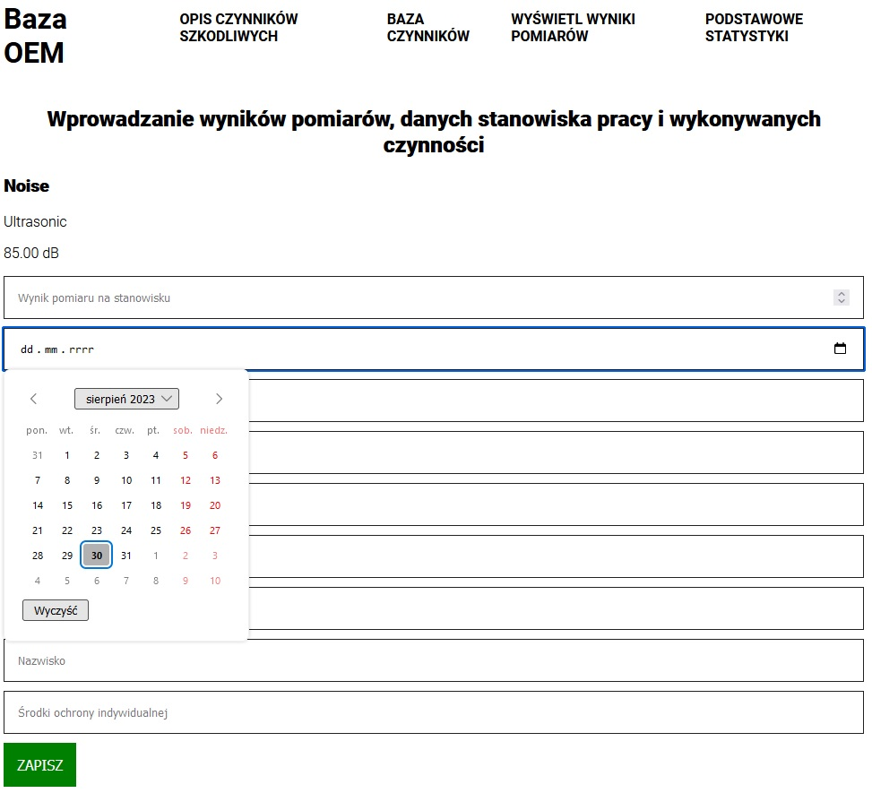
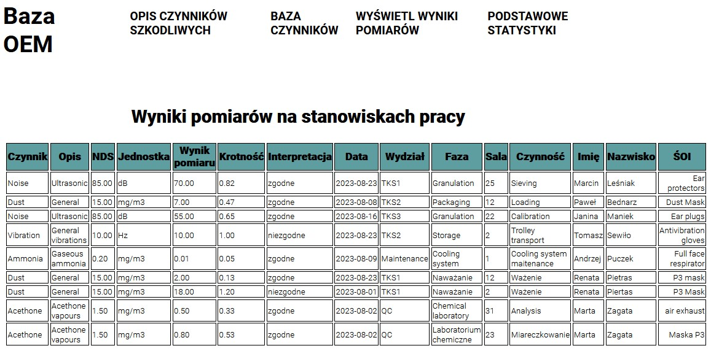

# OEMDataBase

Marcin Leśniak, Studia podyplomowe Java Web Development 2022/2023,

Nazwa projektu: Occupational Exposure Measurements Database - Baza wyników pomiarów czynników szkodliwych na
stanowiskach pracy.
Celem projektu jest usprawnienie procesu zarządzania wynikami pomiarów czynników szkodliwych na stanowiskach pracy w
zakładzie pracy.

Aplikacja ma za zadanie umożliwienie wprowadzania przez użytkownika wyników pomiarów czynników szkodliwych na
stanowiskach pracy, a następnie umożliwienie wyświetlania tych wyników w postaci tabel lub wykresów.

Aplikacja składa się z następujących stron:

- strony startowej,
- strony z opisem czynników szkodliwych na stanowiskach pracy i wartościami NDS / NDN,
- strony do wprowadzania i edytowania czynników szkodliwych występujących na stanowiskach pracy,
- strony do wprowadzania wyników pomiarów,
- strony do wyświetlania wyników pomiarów,
- strony z podstawowymi statystykami,

Strona startowa zawiera menu z odnośnikami do kolejnych stron. Na stronie startowej znajduje się odniesienie do wymagań
prawnych dotyczących zasad prowadzenia pomiarów czynników szkodliwych na stanowiskach pracy.

Strona z opisem czynników szkodliwych zawiera ogólny opis idei powstania strony i jej funkcjonalności. Strona zawiera
ponadto definicje czynników szkodliwych (chemiczne, fizyczne, biologiczne), zasady wykonywania pomiarów tych czynników
na stanowiskach pracy oraz zasady interpretacji wyników pomiarów,

Strona do wprowadzania czynników szkodliwych zawiera odpowiednie formularze służące do wprowadzania nowych czynników
oraz edycji czynników już wprowadzonych do bazy.

Strona do wprowadzania wyników posiada, możliwość wybrania wszystkich parametrów opisujących stanowisku pracy jak nazwy
stanowiska pracy, rodzaju czynika szkodliwego, daty pomiaru, wyniku pomiaru, a także imię i nazwisko osoby wykonującej
prace na stanowisku.

Strona do wyświetlania wyników pomiarów posiada, możliwość wyświetlania wyników w postaci tabelarycznej.

Strona z podstawowymi statystykami służy do wyświetlania w postaci graficznej podstawowych zestawień statystycznych
dotyczących wykonywanych pomiarów na stanowiskach pracy.

## Używanie aplikacji

Aplikacja przeznaczona jest do użytku w zakładach pracy, w których wystepują czynniki szkodliwe na stanowiskach pracy.
Pracodawca zainteresowany posiadaniem bazy, wykonywanych na stanowiskach pracy pomiarów powinien wprowadzić do bazy
czynniki szkodliwe, których pomiary wykonuje. Następnie na podstawie otrzymywanych z laboratorium badawczego raportów z
pomiarów pracodawca powinien wprowadzić wyniki pomiarów wykonanych na stanowiskach pracy.

Aplikacja ma za zadanie wyświetlać zebrane wyniki pomiarów na stanowiskach pracy. W tym celu wymagane jest także
wprowadzenie danych dotyczących badanego stanowiska pracy. Dane te podaje się równocześnie z wprowadzanym do bazy
wynikiem pomiaru.

## Strona startowa "Baza OEM"

Strona startowa zawiera poziomy pasek nawigacji w nagłówkowej cześci strony. Poniżej znajduje się fotografia ze znakami
ostrzegawczyni dla czynników szkodliwych w środowisku pracy. Pod fotografią zostało przywołane rozporządzenie Ministra
Zdrowia, na podstawie którego wykonywane są pomiary czynników szkodliwych na stanowiskach pracy. Poniżej tekstu znajduje
się przycisk "Wprowadzanie wyników pomiarów". Przysisk służy do otworzenia strony z formularzem, w którym wymagane jest
wprowadzenie wyników pomiarów oraz szczegółów dotyczących stanowiska pracy.

Poziomy pasek nawigacji w częsci nagłówkowej strony startowej składa się z następujących odnośników:

- klikalnego logo **"Baza OEM"** za którego pomocą istnieje możliwość powrotu na stronę startową z innych stron
  aplikacji,
- odnośnika **"Opis czynników szkodliwych"** za pomocą którego istnieje możliwośc przejścia na stronę opisująca
  najczęściej występujące w środowisku pracy czynniki szkodliwe, ich charakterystyką oraz wartości najwyższych
  dopuszczalnych stężeń i natężeń w środowisku pracy,
- odnośnika **"Baza czynników"** prowadzącego do strony z wybieralną listą czynników szkodliwych zawierająca także
  wartości najwyższych dopuszczalnych stężen i natężeń tych czynników,
- odnośnika **"Wyświetl wyniki pomiarów"** prowadzącego do strony z podsumowaniem wykonanych i zapisanych w bazie
  wyników pomiarów na stanowiskach pracy,

## Strona "Opis czynników szkodliwych"

Strona otwierająca się po kliknięciu, na odnośnik "opis czynników szkodliwych" opisuje najczęściej występujące w
środowisku pracy czynniki szkodliwe. Skupia się na wyjaśnieniu definicji czynnika szkodliwego takiego jak np. hałas lub
czynniki chemiczne, następnie opisuje sposób działania szkodliwego czynnika na organizm człowieka oraz przywołuje
wartości najwyższych dopuszczalnych stężeń i natężeń dla tych czynników. Na stronie znajduje się także wyjaśnienie
definicji najwyższego dopuszczalnego stężenia oraz Najwyższego dopuszczalnego natężenia. Dodatkowo na stronie znajduje
się wyjaśnienie pojęcia OEL stosowanym w krajach zachodnich, które jest równoznaczne z pojęciem NDS / NDN.

## Strona "Baza czynników"

Strona "Baza czynników" otwiera się po kliknięciu, na odnośnik "baza czynników". Na stronie znajduje się interaktywna
tabela zawierająca w poszczególnych wierszach nazwy czynników szkodliwych, które mogą występować na stanowiskach pracy i
dla których będą prowadzone pomiary i wprowadzane do bazy wyniki tych pomiarów. Tabela składa się także z dwóch kolumn.
Pierwsza kolumna jest kolumną opisową danego czynnika, natomiast w kolumnie drugiej znajduje się wartość najwyższego
dopuszczalnego stężenia lub natężenia danego czynnika wynikająca z rozporządzenia oraz dwa przyciski:

- **edytuj** - przycisk służy do przekierowania na stronę, na której istnieje możliwość edycji danych dla danego
  czynnika
  szkodliwego,
- **usuń** - przycisk służy do usunięcia danego czynnika szkodliwego z bazy,

Poniżej tabeli z czynnikami szkodliwymi znajduje się przycisk **"dodaj"**. Przycisk służy do przekierowania na stronę,
na której istnieje możliwość dodania nowego czynnika szkodliwego do bazy wraz z wartościami NDS oraz opisem czynnika.

## Strona "Wprowadzanie wyników pomiarów"

Wyjście na stronę "Wprowadzanie wyników pomiarów: odbywa się poprzez kliknięcie, na przycisk "Wprowadzanie wyników
pomiarów" znajdujący się na stronie głównej na dole strony. Na stronie "wprowadzanie wyników pomiarów" wyświetla się
interaktywna tabela zawierająca w poszczególnych wierszach nazwy czynników chemicznych, które mogą występowac na
stanowiskach pracy i dla których będą wprowadzane do bazy wyniki pomiarów. Tabela składa się także z dwóch kolumn.
Pierwsza kolumna jest kolumną opisową danego czynnika, natomiast w kolumnie drugiej znajduje się wartość najwyższego
dopuszczalnego stężenia lub natężenia danego czynnika wynikająca z rozporządzenia oraz jeden przycisk "wprowadź".

Po kliknięciu, na przycisk **"wprowadź"** przy danym czynniku szkodliwym otwiera się strona zawierająca interaktywny
formularz do wprowadzania danych z pomiaru na stanowisku pracy. W poszczególnych wierszach tabeli należy wprowadzić
następujące dane:

- wynik pomiaru na stanowisku pracy będący liczbą z przedziału od 0 do 1000,
- datę w formacie xxxx-xx-xx,
- nazwę wydziału,
- numer pomieszczenia,
- nazwę fazy operacyjnej,
- nazwę czynności,
- imię pracownika wykonującego daną czynność,
- nazwisko pracownika wykonującego daną czynność,
- stosowane przez pracownika środki ochrony indywidualnej,

Poniżej tabeli z formularzem do wprowadzania danych znajduje się przycisk **"Zapisz"**, którego funkcją jest zapisanie
wprowadzonych danych do bazy.

Datę pomiaru wprowadza się poprzez kliknięcie, na ikonę kalendarza, wybranie odpowiedniej daty i kliknięcie ok.

## Strona "Wyświetl wyniki pomiarów"

Strona "Wyświetl wyniki pomiarów" ma zadanie wyświetlać wprowadzone do bazy wyniki pomiarów wraz z parametrami
czynników, dla których pomiary były wykonywane. Strona prezentuje tabelę zawierającą wszystkie wprowadzone wyniki. W
tabeli znajdują się poza wprowadzonymi danymi wyniki obliczeń krotności zmierzonych stężeń i natężeń czynników
szkodliwych na stanowiskach pracy wraz z interpretacją wyniku. Krotność stężenia jest to wartość obliczona z podzielenia
wyniku pomiaru przez wartość najwyższego dopuszczalnego stężenia / natężenia, określoną dla danego czynnika. Krotności
mniejsze od 1 wskazują, że wynik pomiaru mieści się w normie, a stanowisko pracy jest bezpieczne. Wynik równy jeden lub
wyższy wskazuje, że na stanowisku pracy występują przekroczenia czynników szkodliwych i pracodawca zobowiązany jest
wprowadzić zabezpieczenia techniczne mające na celu obniżenie stężenia czynnika szkodliwego poniżej normy.

## Strona "Podstawowe statystyki"

Strona "Podstawowe statystyki" ma za zadanie wyświetlić graficznie wybrane podstawowe statystyki dotyczące wykonywanych
pomiarów. Między innymi na wykresie słupkowym wyświetlane są ilości wykonanych pomiarów na stanowiskach pracy z
podziałem na poszczególne czynniki szkodliwe.

## Budowa aplikacji "OEM Database"

Aplikacja internetowa "OEMDatabase" została napisana z użyciem języka Java, HTML oraz CSS. Aplikacja została napisana z
użyciem narzędzi Spring Boot, Maven, SQL Server oraz Thymeleaf.
