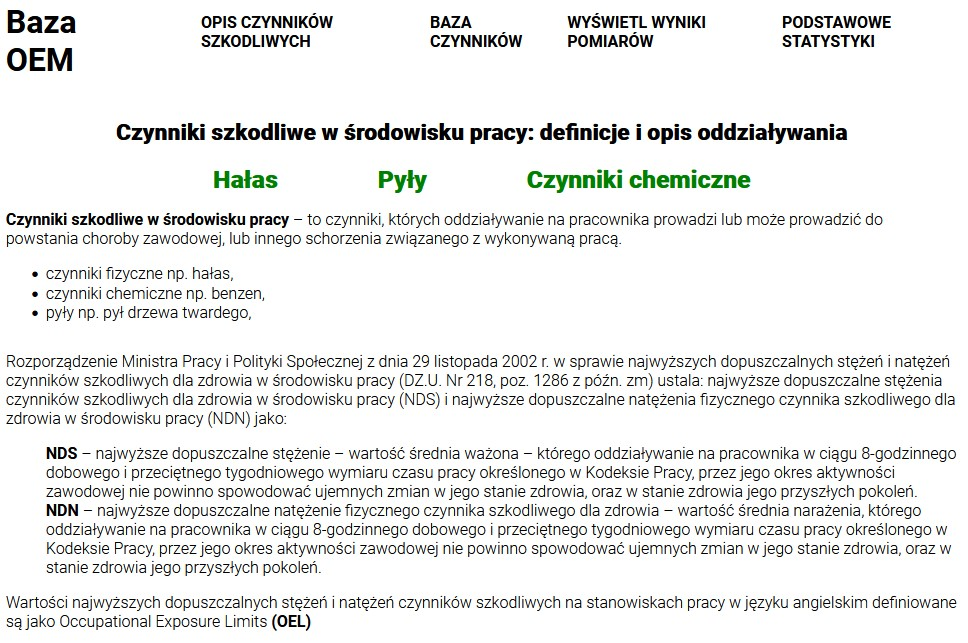

# OEMDataBase
Marcin Leśniak, Studia podyplomowe Java Web Development 2022/2023,

Nazwa projektu: Occupational Exposure Measurements Database - Baza wyników pomiarów czynników szkodliwych na stanowiskach pracy.
Celem projektu jest usprawnienie procesu zarządzania wynikami pomiarów czynników szkodliwych na stanowiskach pracy w zakładzie pracy.

Aplikacja będzie miała za zadanie umożliwienie wprowadzania przez użytkownika wyników pomiarów czynników szkodliwych na stanowiskach pracy a następnie umożliwienie wyświetlania tych wyników w postaci tabel lub wykresów.

Aplikacja będzie składała się z następujących stron:
- strony startowej,
- strony do wprowadzania wyników pomiarów,
- strony do wyświetlania wyników pomiarów,

Strona startowa zawierać będzie ogólny opis idei powstania strony i jej funkcjonalności. Strona zawierac będzie ponadto definicje czynników szkodliwych (chemiczne, fizyczne, biologiczne), zasady wykonywania pomiarów tych czynników na stanowiskach pracy oraz zasady interpretacji wyników pomiarów,

Strona do wprowadzania wyników posiadac będzie możliwość wybrania nazwy stanowiska pracy, rodzaju czynika szkodliwego, daty pomiaru, wyniku pomiaru oraz jego interpretacji, a także imię i nazwisko osoby wykonującej prace na stanowisku,

Strona do wyświetlania wyników pomiarów posiadać będzie możliwość wyświetlania wyników w postaci tabelarycznej oraz w postaci wykresów, w tym w podziale na stanowiska pracy i czynniki szkodliwe.

## Strona startowa "Baza OEM"
Strona startowa zawiera poziomy pasek nawigacji w nagłówkowej cześci strony. Poniżej znajduje się fotografia ze znakami ostrzegawczyni dla czynników szkodliwych w środowisku pracy. Pod fotografią zostało przywołane rozporządzenie Ministra Zdrowia na podstawie którego wykonywane sa pomiary czynników szkodliwych na stanowiskach pracy. Poniżej tekstu znajduje się przycisk "Wprowadzanie wyników pomiarów". Przysisk służy do otworzenia strony z formularzem w którym wymagane jest wprowadzenie wyników pomiarów oraz szczegółów dotyczących stanowiska pracy.

Poziomy pasek nawigacji w częsci nagłówkowej strony startowej składa się z następujących odnośników:
- klikalnego logo **"Baza OEM"** za którego pomocą istnieje możliwość powrotu na stronę startową z innych stron aplikacji,
- odnośnika **"Opis czynników szkodliwych"** za pomocą którego istnieje możliwośc przejścia na stronę opisująca najczęściej występujące w środowisku pracy czynniki szkodliwe, ich charakterystyką oraz wartości najwyższych dopuszczalnych stężeń i natężeń w środowisku pracy,
- odnośnika **"Baza czynników"** prowadzącego do strony z wybieralną listą czynników szkodliwych zawierająca także wartości najwyższych dopuszczalnych stężen i natężeń tych czynników,
- odnośnika **"Wyświetl wyniki pomiarów"** prowadzącego do strony z podsumowaniem wykonanych i zapisanych w bazie wyników pomiarów na stanowiskach pracy,

### Strona "Opis czynników szkodliwych"
Strona otwierająca się po kliknięciu na odnośnik "opis czynników szkodliwych"  opisuje najczęściej występujące w środowisku pracy czynniki szkodliwe. Skupia się na wyjaśnieniu definicji czynnika szkodliwego otakiego jak np hałas lub czynniki chemiczne, następnie opisuje sposób działania szkodliwego czynnika na organizm człowieka oraz przywołuje wartości najwyższych dopuszczalnych stężeń i natężeń dla tych czynników. Na stronie znajduje sie także wyjaśnienie definicji najwyższego dopuszczalnego stężenia oraz Najwyższego dopuszczalnego natężenia. Dodatkowo na stronei znajduje się wyjasnienie pojęcia OEL, które jest równoznaczne z pojęciem NDS / NDN stosowanym w krajach zachodnich.

### Strona "Baza czynników"
Strona "Baza czynników" otwiera sie po kliknięciu na odnośnik "baza czynników". Na stronie znajduje sie interaktywna tabela zawierająca w poszczególnych wierszach nazwy czynników szkodliwych, które mogą występowac na stanowiskach pracy i dla których będa prowadzone pomiary i wprowadzane do bazy wyniki tych pomiarów. Tabela składa się także z dwóch kolumn. Pierwsza kolumna jest kolumną opisową danego czynnika, natomiast w kolumnie drugiej znajduje się wartość najwyższego dopuszczalnego stężenia lub natężenia danego czynnika wynikająca z rozporządzenia oraz dwa przyciski:
- **edytuj** - przycisk służy do przekierowania na stronę na której istnieje możliwość edycji danych dla danego czynnika szkodliwego,
- **usuń** - przycisk służy do usunięcia danego czynnika szkodliwego z bazy,

Poniżej tabeli z czynnikami szkodliwymi znajduje sie przycisk **"dodaj"**. Przycisk służy do przekierowania na stronę na której istnieje możliwość dodania nowego czynnika szkodliwego do bazy wraz z wartościami NDS oraz opisem czynnika.

### Strona "Wyświetl wyniki pomiarów"
Strona "wyświetl wyniki pomiarów" ma w założeniu wyświetlać wprowadzone do bazy wyniki pomiarów wraz z parametrami czynników, dla których pomiary były wykonywane.

### Strona "Wprowadzanie wyników pomiarów"
Wyjście na stronę "Wprowadzanie wyników pomiarów: odbywa sie poprzez kliknięcie na przycisk "Wprowadzanie wyników pomiarów" znajdujący sie na stronie głównej na dole strony. Na stronie "wprowadzanie wyników pomiarów" wyświetla się interaktywna tabela zawierająca w poszczególnych wierszach nazwy czynników chemicznych, które mogą występowac na stanowiskach pracy i dla których będą wprowadzane do bazy wyniki pomiarów. Tabela składa się także z dwóch kolumn. Pierwsza kolumna jest kolumną opisową danego czynnika, natomiast w kolumnie drugiej znajduje się wartość najwyższego dopuszczalnego stężenia lub natężenia danego czynnika wynikająca z rozporządzenia oraz jeden przycisk "wprowadź".

Po kliknięciu na przycisk **"wprowadź"** przy danym czynniku szkodliwym otwiera się strona zawierająca interaktywny formularz do wprowadzanai danych z pomiaru na stanowisku pracy. W poszczególnych wierszach tabeli należy wprowadzić następujące dane:
- wynik pomiaru na stanowisku pracy będący liczbą z przedziału od 0 do 1000,
- datę w formacie xxxx-xx-xx,
- nazwę wydziału,
- numer pomieszczenia,
- nazwę fazy operacyjnej,
- nazwę czynności,
- imię pracownika wykonującego daną czynność,
- nazwisko pracownika wykonującego daną czynność,
- stosowane przez pracownika środki ochrony indywidualnej,

Poniżej tabeli z formularzem do wprowadzania danych znajduje się przycisk **"Zapisz"**, którego funkcją jest zapisanie wprowadzonych danych do bazy.

## Budowa aplikacji "OEM Database"
Aplikacja internetowa "OEMDatabase" została napisana z użyciem języka Java, HTML oraz CSS. 
Aplikacja została napisane z użyciem technologii Spring Framework oraz Thymeleaf.

## Używanie aplikacji

Aplikacja przeznaczona jest do użytku w zakładach pracy w których wystepują czynniki szkodliwe na stanowiskach pracy.
Pracodawca zainteresowany posiadaniem bazy wykonywanych na stanowiskach pracy pomiarów powinien wprowadzić do bazy czynniki szkodliwe, których 
pomiary wykonuje. Następnie na podstawie otrzymywanych z laboratorium badawczego raportów z pomiarów pracodawca powinien wprowadzić wyniki pomiarów wykonanych na stanowiskach pracy.

Aplikacja ma za zadanie wyświetlać zebrane wyniki pomiarów na stanowiskach pracy a także wykonywać podstawowe statystyki. W tym celu wymagane jest także wprowadzenie danych dotyczących badanego stanowiska pracy. Dane te podaje się równocześnie z wprowadzanym do bazy wynikiem pomiaru.